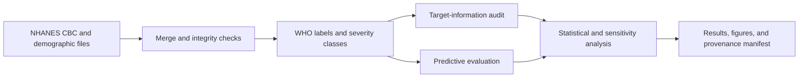
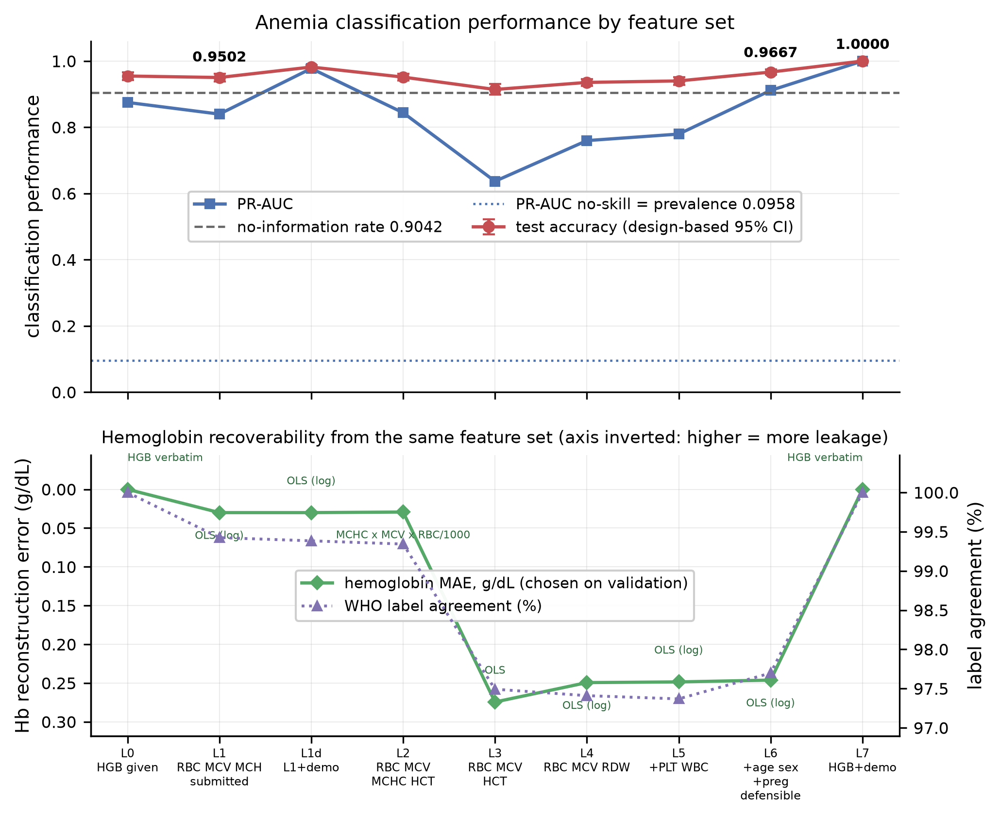
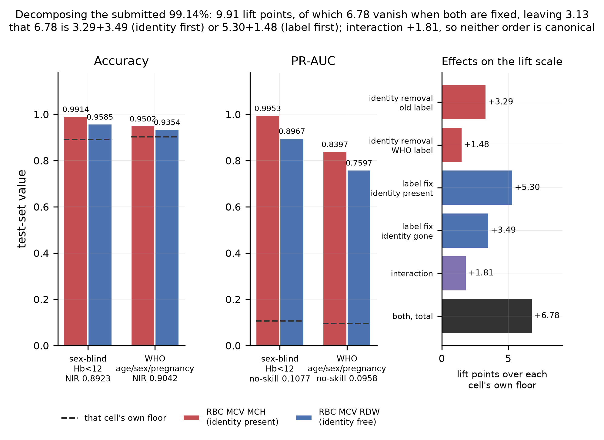
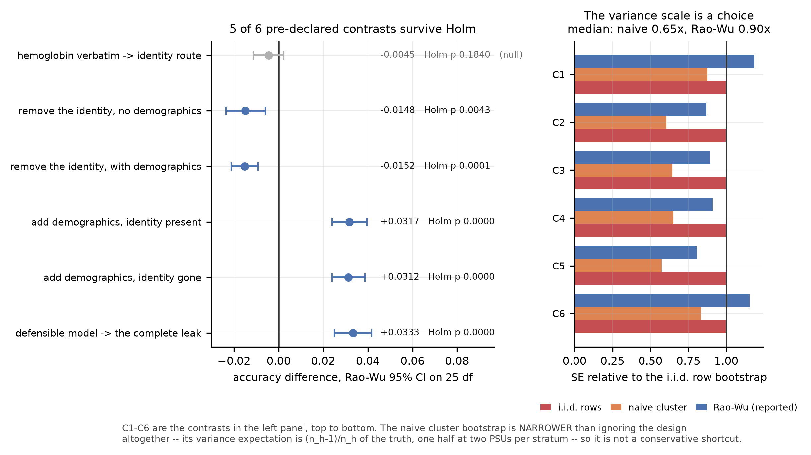
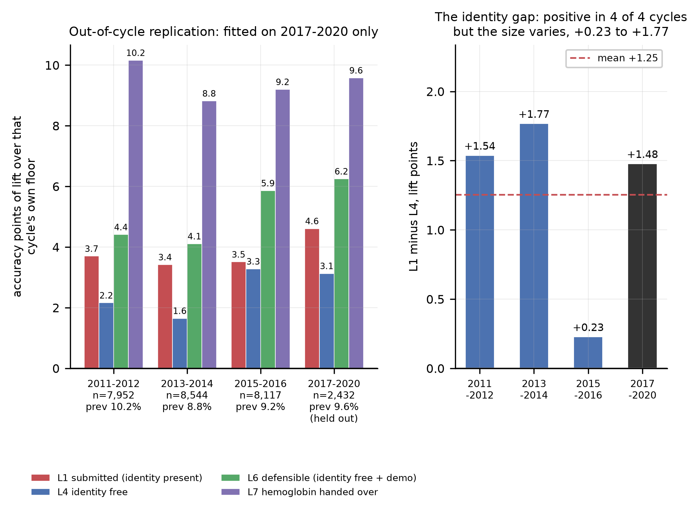

# CBC Anemia Target-Information Audit

[](https://www.python.org/)
[](LICENSE)

Reproducible NHANES analysis of whether removing the hemoglobin (HGB) column
removes hemoglobin-related target information from complete blood count (CBC)
feature sets.

## Project Scope

| Area | Description |
| --- | --- |
| Research domain | CBC-based anemia classification and severity analysis |
| Research question | Does removing HGB remove HGB-related information from the CBC feature matrix? |
| Primary data | Official CDC/NCHS NHANES 2017--March 2020 pre-pandemic public-use files |
| Analysis | HGB reconstruction, controlled feature ladder, classifier comparison, and sensitivity analysis |
| Inference | Paired contrasts, Holm correction, and NHANES survey-design uncertainty estimates |
| Replication | Separate replay on the 2011--2012, 2013--2014, and 2015--2016 cycles |
| Demonstration | Optional L6 screening application that does not request HGB |

## Research Question and Scope

Anemia labels are defined from hemoglobin. Several red-cell indices reported in
a CBC are related to hemoglobin through analyzer equations:

```text
MCV  = 10 × HCT / RBC
MCH  = 10 × HGB / RBC
MCHC = 100 × HGB / HCT
```

Consequently, deleting the HGB column does not by itself demonstrate that
hemoglobin-related information has been excluded. This repository audits
deterministic target-information recoverability and its relationship to model
performance. It does not propose a new classifier or a new clinical relationship.

The analysis distinguishes recoverability from the broader term target leakage.
For example, the performance difference between the MCH-containing L1 rung and
the identity-reduced L4 rung is not treated as a pure leakage estimate, because
the two rungs also contain different physiological variables.

## Study Workflow



## Data Sources

The project uses official public-use files from the [CDC/NCHS NHANES
program](https://wwwn.cdc.gov/nchs/nhanes/continuousnhanes/default.aspx?Cycle=2017-2020).

| Cycle | CBC file | Demographics file | Weight | Role |
|---|---|---|---|---|
| 2017--March 2020 | `P_CBC.XPT` | `P_DEMO.XPT` | `WTMECPRP` | Primary analysis |
| 2015--2016 | `CBC_I.XPT` | `DEMO_I.XPT` | `WTMEC2YR` | Out-of-cycle replication |
| 2013--2014 | `CBC_H.XPT` | `DEMO_H.XPT` | `WTMEC2YR` | Out-of-cycle replication |
| 2011--2012 | `CBC_G.XPT` | `DEMO_G.XPT` | `WTMEC2YR` | Out-of-cycle replication |

The primary merge contains 13,772 records. Complete-case processing retains
12,156 records and excludes 1,616 records with required values missing. The
earlier cycles are replayed separately and are not pooled with the primary
cycle because their survey design variables are cycle-specific.

Raw NHANES files are downloaded locally by `src/download_data.py` and are not
redistributed in this repository. The downloader checks the expected XPORT
structure, file size, and record count before accepting a file.

## Methodology

- **Feature ladder:** nine entries covering direct HGB, analyzer-derived routes,
  identity-reduced CBC features, and demographic variants.
- **HGB audit:** four closed-form reconstruction routes and learned
  reconstruction checks.
- **Classifiers:** logistic regression, RBF SVM, decision tree, Random Forest,
  Extra Trees, Histogram Gradient Boosting, and XGBoost, with majority and
  stratified baselines.
- **Labels:** age-, sex-, and pregnancy-specific WHO hemoglobin cut-offs. The
  severity analysis uses four WHO bands and merges the moderate and severe
  classes because the severe class is small. A separate sensitivity analysis
  evaluates a single 12.0 g/dL cut.
- **Evaluation split:** a fixed 60%/20%/20% row-wise split, stratified by the
  four-class severity label, using random seed 42. Model and threshold choices
  use the validation block; the test block is evaluated once.
- **Inference:** paired contrasts use Holm correction and Rao--Wu rescaled
  bootstrap uncertainty with the NHANES survey design.

## Technology Stack

| Area | Technology |
| --- | --- |
| Language | Python |
| Data analysis | NumPy and pandas |
| Machine learning | scikit-learn and XGBoost |
| Statistical analysis | SciPy and statsmodels |
| Figures | Matplotlib |
| Quality checks | pytest, coverage, Pyflakes, and dependency checks |

## Tested Environment

The latest full pipeline run was completed with Python 3.14.7 on Windows 11.
The package versions used for that run are pinned in `requirements.txt` and are
recorded in `results/run_manifest.json`. Reproduction on a different Python or
operating-system version may produce implementation-level differences.

## Repository Structure

```text
src/
  download_data.py     Download and validate NHANES files
  dataprep.py          Cohort, labels, feature ladder, split, and survey design
  identity_audit.py    Analyzer identities and HGB recoverability
  ablation.py          Ladder, decomposition, contrasts, and sensitivities
  benchmark.py         Classifier comparison and evaluation metrics
  weighted.py          Survey-weighted prevalence and model metrics
  figures.py           Reproducible result figures
  anemia_app.py        L6 screening demonstration
  run_all.py           Full pipeline and provenance manifest

tests/                 Unit and contract tests
results/               JSON evidence and run manifest
figures/               Generated figures and paper workflow source
models/                Locally generated models; ignored by Git
requirements.txt       Pinned runtime and test dependencies
quality_check.py       Fast tests, static checks, and dependency check
```

Manuscript files and literature-review materials are maintained separately and
are not part of this code repository.

## Installation and Reproduction

From the repository root:

```bash
pip install -r requirements.txt
python src/run_all.py
python quality_check.py
```

`run_all.py` executes the stages in dependency order, records their status and
timings, and writes `results/run_manifest.json`. The manifest records the
Python and library versions, random seed, hashes of the eight input files,
source files, result JSON files, generated figures, and model pickles. It also
names files intentionally excluded from hashing because they are generated
outside the numerical pipeline or change during interactive use.

The full pipeline is computationally heavier than `quality_check.py`. The
quality check does not rerun the research pipeline; after changing source code
or dependencies, run the full pipeline first.

Individual stages can also be run in this order:

```bash
python src/download_data.py
python src/dataprep.py
python src/identity_audit.py
python src/ablation.py
python src/benchmark.py
python src/weighted.py
python src/figures.py
python src/anemia_app.py
```

## Results at a Glance

The values below are taken from the current JSON result files. The confidence
intervals and *p*-values for paired accuracy contrasts use the Rao--Wu design-
based procedure; the L1--L4 comparison also reflects the physiological
differences between those feature rungs.

| Analysis | Main result | 95% confidence interval | *p*-value |
| --- | --- | --- | --- |
| Primary cohort | 13,772 merged records; 12,156 complete cases; 1,616 excluded | Not applicable | Not applicable |
| HGB reconstruction | MAE 0.0302--0.0315 g/dL; WHO-label agreement 99.325%--99.441% | Not applicable | Not applicable |
| HGB present (L0) versus submitted rung (L1) | Accuracy 0.9548 versus 0.9502; difference -0.0045 | [-0.0113, 0.0023] | 0.184 (Holm: 0.184) |
| Submitted rung (L1) versus identity-reduced rung (L4) | Accuracy 0.9502 versus 0.9354; difference -0.0148 | [-0.0237, -0.0059] | 0.0021 (Holm: 0.0043) |
| Out-of-cycle replication | L1--L4 difference positive in all three earlier cycles; magnitude 0.23--1.77 percentage points | Not applicable | Not applicable |
| Survey-weighted prevalence | 6.63% with design-based SE 0.45 percentage points | [5.76%, 7.62%] | Not applicable |

The 1.48-point difference is not interpreted as a pure leakage effect. L1 and
L4 differ in both target-information recoverability and physiological feature
content. The results support an audit of recoverability and model behavior, not
a universal estimate of accuracy inflation.

## Selected Result Figures

The generated figures are reproducible from the JSON result files. The four
figures below provide a compact visual summary of the feature ladder, the
label/feature decomposition, the paired contrasts, and the out-of-cycle replay.

### Feature Ladder



### Label and Feature Decomposition



### Paired Contrasts



### Out-of-Cycle Replication



## Tests and Quality Checks

```bash
python -m pytest tests -q
python -m pytest tests -q -m "not slow"
python -m pytest tests -q --cov=src --cov-report=term-missing
python quality_check.py
```

The pytest suite checks analyzer identities, label construction, feature-rung
definitions, split and survey-design properties, download-file integrity,
result contracts, and application input guards. The `quality_check.py` command
also runs Pyflakes static-name checks and `pip check` dependency checks. The
repository currently contains 111 test-function definitions
across 9 test files, which expand to 339 collected test cases through
parameterization. The full suite runs all 339 cases. The faster command with
the `not slow` marker runs 103 cases and skips tests that require the NHANES
files or committed result artefacts. The latest automated source coverage is
24.1% (displayed as 24%); this is a software-quality measure and does not
replace reproduction of the full research pipeline.

## Known Limitations

- Complete-case exclusion is non-random with respect to age and may introduce
  selection bias.
- The primary row-wise split permits PSU sharing between partitions.
- The NHANES analysis is not independent clinical external validation.
- Out-of-cycle replication is not a substitute for validation on an independent
  clinical dataset.
- The screening demonstration is a research tool and is not a medical device or
  a substitute for laboratory diagnosis.

## Screening Demonstration

```bash
python src/anemia_app.py
```

The demonstration uses the identity-reduced L6 feature set: RBC, MCV, RDW, age,
sex, and pregnancy. It does not request HGB because HGB defines the target in
this study. Input guards reject invalid combinations and record rejections in
the locally generated `models/rejections.json` file.

## Author

Guna Rithvick

## License

The code is released under the [MIT License](LICENSE). The MIT License applies
to the code in this repository; it does not relicense the NHANES files. NHANES
data are obtained from the CDC/NCHS public-use files linked above and remain
subject to the [NCHS Data User Agreement](https://www.cdc.gov/nchs/policy/data-user-agreement.html).
Users must consult the official NHANES documentation and analytic guidance and
use the data only for permitted statistical analysis or reporting.
